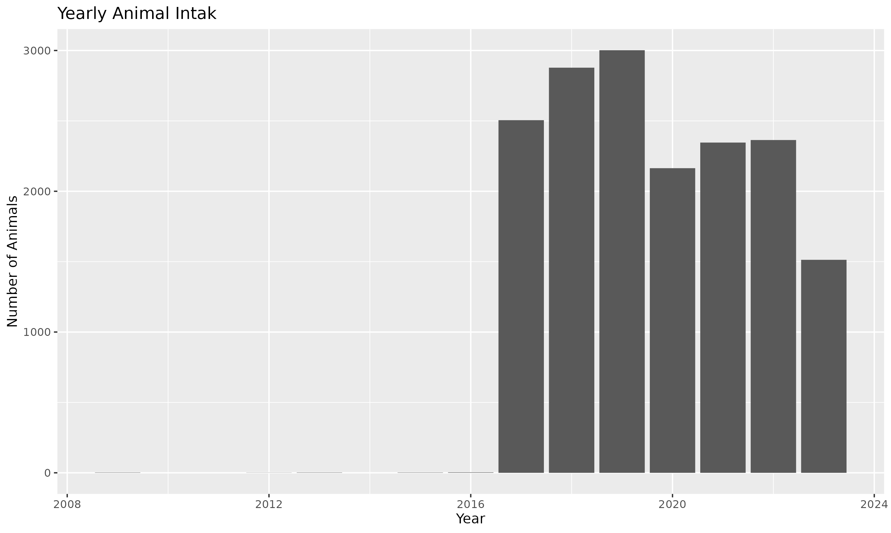
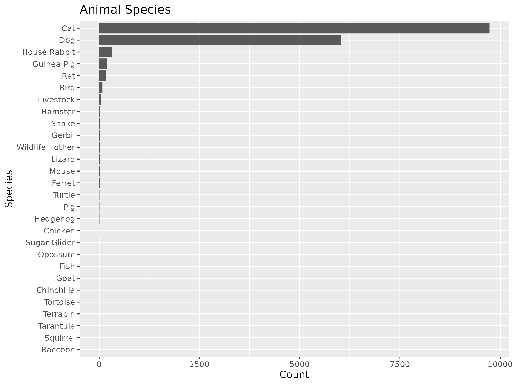
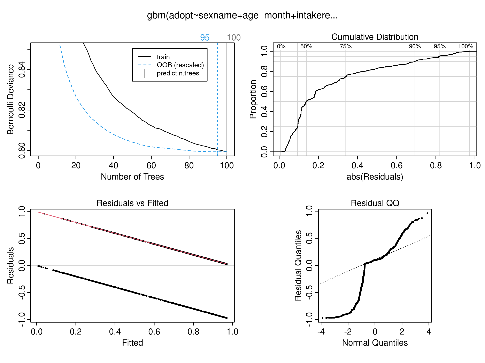

```{r setup, include=FALSE}
knitr::opts_chunk$set(
  echo = FALSE,
  message = FALSE,
  warning = FALSE,
  fig.height = 8,
  fig.width = 10
)

```

## Introduction

The data I used were from [City of Bloomington Open Data](https://data.bloomington.in.gov/Public-Works/Animal-Shelter-Animals/e245-r9ub/about_data). The raw data contains 31.6k rows of information of animals the shelters took in, "demographics" like age, sex, species, breed, name, etc., as well as shelter-related info like took-in date, took-in reason, return date, return reason, decease date, decease return etc.. If an animal was took in, returned, then came back to the shelter again, it would have two records.

In this analysis, I want to explore whether certain factors of an animal like age, sex, species etc. are related to its possibility to get adopted.

## Data Description

The data contains mainly animals took in during year 2017-2023, with very few animals took in before 2017:



The most species took in were, as one can expect, cats and dogs, followed by rabbits, Guinea pigs, rats, and birds:


And some reasons for the intake are:


## Regression model

### GMB model
I built a Gradient Boosting Machine (GBM) model to analyze what factor are related to the possibility of adoption, and ended up including age, sex, species, and intook reason in the final model. I also added a 2-way interaction term in the model. 

The deviance and residuals look alright though the Q-Q plot is a little concerning, indicating the data is skewed. 


### Model Comparison
I then compared the performance of the GBM model with a GLM model by the correctness of their prediction, and the GBM is the winner:


### Interpretation using GLM

Though not doing well in prediction, GLM is still useful in providing insights of the effects of each factor. 

```{r}
library(tidyverse)
data <- read_csv(("data/model_data.csv"))
model_glm <- glm(adopt ~ sexname + age_month + intakereason_new + speciesname_new,
                 data = data, family = "binomial")
summary(model_glm)
```

Seems like female, young animals are preferred. Below are two bar plots visualizing what species and intook reasons are preferred (or not preferred): 


The intepretation is that animals born in a shelter were more likely to get adopted and rabbits are the least likely to get adopted. 

## Future Questions

The dataset contains some other interesting variables that I was not able to utilize. For example, it might be interesting to see what influences the time between taking in and adoption -- how long an animal needs to wait before getting adopted. Or what influences a sheltered animals age, and compare it with pet animals. 
